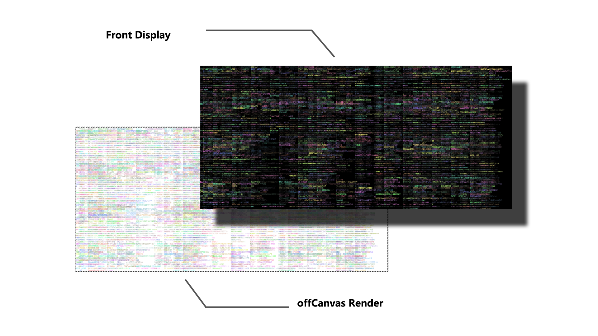

# Qalaxy

高性能海量弹幕组件, 该组件的性能可以达到您浏览器或者物理机的承受极限.
与常规弹幕系统不同, 这个组件使用了离屏预渲染来解决海量弹幕下的渲染问题.
不过值得注意的是, 因为该组件使用预生成静态图片来做弹幕显示, 所以对于复杂弹幕不支持（比如：不同速度、可点击等）.

### 版本
0.0.1 (技术预览版本)

### 概览

首先, 离屏渲染器会在一个不可见的`Canvas`中根据弹幕列表以增量的形式渲染单屏弹幕, 如果弹幕满足一屏或者已经到达单屏时间周期, 这时候渲染器就会对当前`Canvas`进行截屏, 并将数据保存为`Bitmap`, 并传递给显示器.
显示器接收到`Bitmap`之后会根据情况决定是否立即渲染, 如果渲染, 则使用`requestAnimationFrame`动画来对当前图像进行位移, 并将下一屏拼接在当前屏后面, 以此往复. 

这种工作模式非常具有惰性, 并不会根据帧数实时渲染弹幕到可视区域, 可以使用非常之少的开销来完成海量弹幕吞吐而游刃有余, 当前实测, 单屏弹幕量`12000`条的情况下, 在处理器为`Intel(R) Core(TM) i7-8700 CPU @ 3.20GHz`的平台上, 处理器占用率基本维持在`2%`上下,
不过当前因为一些问题没有优化, 所以目前内存占用率和GPU使用率会比较高, 不过对于头疼的大量弹幕在笔记本等弱性能设备上的表现有相当的改观.

### 现有问题
* 首屏渲染延迟问题.
* 单弹幕字体样式定义.
* 更灵活的控制（暂停恢复等）.

### API

#### `{@class}` new Qalaxy(option): Qalaxy
- `option`  `{Option}` 事件循环总线.

#### `{@interface}` Option
- `el` `{Element}` 容器节点.
- `rate` `{number}` 弹幕速率 (弹幕多少秒从屏幕右边到左边).
- `color` `{string}` 默认字体颜色.
- `opacity` `{number}` 透明度.
- `size` `{number}` 字体大小.
- `font` `{string}` 字体.

#### `{@interface}` Value
- `text` `{string}` 弹幕内容.
- `color` `{string}` 弹幕颜色.

#### `{@function}` Qalaxy.append(values): void
- `values` `{Array<Value>}` 弹幕列表.

### License
[GPL](./LICENSE)
Copyright (c) 2020 Mr.Panda.